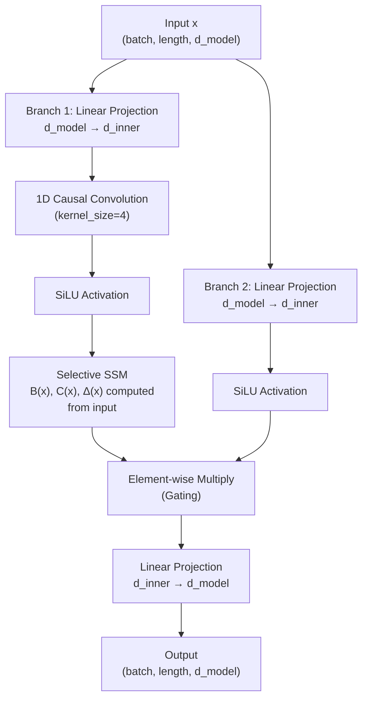
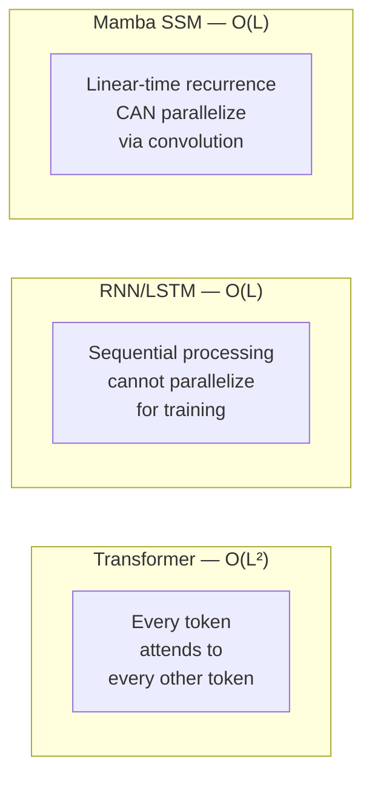

# Complete Guide: State Space Models & Building a Mamba-Based NIDS

> **For**: Soumaditya Mukherjee, Ramsha Riyasat Fatima, Kaivalya Lehekar  
> **Course**: Innovative Design Project (IDP), VIT Chennai, 2026  
> **Reference**: [NIDS_Mamba_Report (1).docx.pdf](file:///c:/Users/souma/Desktop/VIT/IDP_Innovative%20Design%20Project/NIDS_Mamba_Report%20(1).docx.pdf)

---

## Table of Contents
1. [Part A — Everything About State Space Models](#part-a--everything-about-state-space-models)
2. [Part B — Step-by-Step Guide to Building Your NIDS](#part-b--step-by-step-guide-to-building-your-mamba-based-nids)
3. [Part C — Practical Code Walkthrough](#part-c--practical-code-walkthrough)
4. [Part D — Troubleshooting & Tips](#part-d--troubleshooting--tips-for-2nd-year-teams)

---

# Part A — Everything About State Space Models

## 1. What Is a State Space Model (SSM)?

A State Space Model is a mathematical framework borrowed from **control theory** and **signal processing** that describes how a system evolves over time using two equations:

### The Continuous-Time State Space Equations

$$h'(t) = \mathbf{A}\,h(t) + \mathbf{B}\,x(t)$$

$$y(t) = \mathbf{C}\,h(t) + \mathbf{D}\,x(t)$$

Where:
| Symbol | Meaning | Intuition |
|--------|---------|-----------|
| $x(t)$ | **Input** at time $t$ | The new network packet / traffic feature arriving right now |
| $h(t)$ | **Hidden state** at time $t$ | The model's "memory" — a compressed summary of everything it has seen so far |
| $y(t)$ | **Output** at time $t$ | The prediction — "Is this traffic normal or an attack?" |
| $\mathbf{A}$ | **State transition matrix** | Controls how the memory evolves on its own (what to remember, what to forget) |
| $\mathbf{B}$ | **Input projection matrix** | Controls how much the new input influences the memory |
| $\mathbf{C}$ | **Output projection matrix** | Controls how the memory is read to produce an output |
| $\mathbf{D}$ | **Skip connection** | A direct pass-through from input to output (often set to 0) |

### Plain English

Think of it like this: you're a security guard watching a CCTV feed of network traffic.

- **$h(t)$** is your **mental state** — everything you remember about what you've seen so far.
- **$\mathbf{A}$** is your **memory policy** — which past events you keep remembering and which you start to forget.
- When a **new event $x(t)$** happens (a new packet arrives), **$\mathbf{B}$** decides how much that event updates your mental state.
- When asked "Is there an attack?", **$\mathbf{C}$** determines how you read your memory to give an **answer $y(t)$**.

The key insight: **the hidden state $h(t)$ is a fixed-size vector regardless of how long the sequence is.** Whether you've seen 100 packets or 100,000 packets, the memory stays the same size. This is why SSMs can process very long sequences efficiently.

---

## 2. From Continuous to Discrete: How Computers Actually Use SSMs

Computers work in discrete time steps, not continuous time. So we **discretize** the continuous equations using a step size $\Delta$:

$$h_k = \bar{\mathbf{A}}\,h_{k-1} + \bar{\mathbf{B}}\,x_k$$

$$y_k = \mathbf{C}\,h_k$$

Where $\bar{\mathbf{A}}$ and $\bar{\mathbf{B}}$ are the **discretized** versions of $\mathbf{A}$ and $\mathbf{B}$, computed using the **Zero-Order Hold (ZOH)** method:

$$\bar{\mathbf{A}} = \exp(\Delta \mathbf{A})$$

$$\bar{\mathbf{B}} = (\Delta \mathbf{A})^{-1}(\exp(\Delta \mathbf{A}) - \mathbf{I}) \cdot \Delta \mathbf{B}$$

### Why This Matters for You

This discretization is what lets SSMs work on sequences of network packets (which arrive at discrete time intervals). The step size $\Delta$ controls the "resolution" — how finely the model pays attention to time. The `mamba-ssm` library handles all this math automatically.

---

## 3. The Dual Computation Modes of SSMs

SSMs have a powerful property: they can be computed in **two equivalent ways**.

### Mode 1: Recurrent Mode (For Real-Time / Inference)

Process one token at a time, updating the hidden state:

```
h₁ = Ā·h₀ + B̄·x₁     →  y₁ = C·h₁
h₂ = Ā·h₁ + B̄·x₂     →  y₂ = C·h₂
h₃ = Ā·h₂ + B̄·x₃     →  y₃ = C·h₃
...
```

- **Time complexity**: $O(L)$ — linear in sequence length
- **Memory**: $O(1)$ — constant, just the hidden state
- **Use case**: Real-time inference (your live traffic prediction)

### Mode 2: Convolutional Mode (For Training)

Unroll the recurrence into a single convolution:

$$y = x * \bar{K}$$

Where the **SSM kernel** $\bar{K}$ is:

$$\bar{K} = (\mathbf{C}\bar{\mathbf{B}},\; \mathbf{C}\bar{\mathbf{A}}\bar{\mathbf{B}},\; \mathbf{C}\bar{\mathbf{A}}^2\bar{\mathbf{B}},\; \ldots)$$

- **Advantage**: Can use GPU-parallelized FFT-based convolutions
- **Use case**: Training (process entire sequences in parallel, very fast on GPU)

This dual nature is one of the biggest advantages of SSMs: **train fast in parallel, infer efficiently one step at a time.**

---

## 4. The Evolution: From S4 to Mamba

### S4 (Structured State Spaces for Sequences) — Gu et al., 2021

The breakthrough paper that made SSMs competitive with Transformers. Key innovation: **HiPPO initialization** — a special way to initialize the matrix $\mathbf{A}$ so the model naturally remembers long-range dependencies.

The problem: S4 uses **fixed, input-independent** matrices $\mathbf{A}$, $\mathbf{B}$, $\mathbf{C}$. This means every input is processed in the same way regardless of what the input actually is. The model can't **selectively** pay attention.

### S5, H3, Hyena — Intermediate Steps (2022-2023)

Various papers improved S4's efficiency and gating, but the matrices remained mostly static.

### Mamba (Selective State Spaces) — Gu & Dao, 2023

> [!IMPORTANT]
> **This is the architecture your project uses.** Mamba is the key innovation that makes SSMs work for your NIDS.

Mamba's breakthrough: **make the SSM parameters input-dependent** (selective).

Instead of fixed $\mathbf{B}$, $\mathbf{C}$, and $\Delta$, Mamba computes them as **functions of the current input**:

$$\mathbf{B}_k = \text{Linear}_B(x_k)$$
$$\mathbf{C}_k = \text{Linear}_C(x_k)$$
$$\Delta_k = \text{softplus}(\text{Linear}_\Delta(x_k))$$

### What "Selective" Means — The Key Intuition

Imagine reading a log of network connections:

```
[Normal] [Normal] [Normal] [Normal] [SYN_FLOOD_START] [SYN] [SYN] [SYN] [SYN] [Normal]
```

With a **fixed** SSM (S4), every connection is processed with equal weight — the model treats the SYN flood packets the same way it treats the normal ones. It can still learn patterns, but it's inefficient.

With **Mamba's selective mechanism**:
- When the model sees `[Normal]` traffic, it sets $\Delta$ small → **forget quickly**, this isn't important
- When it sees `[SYN_FLOOD_START]`, it sets $\Delta$ large → **remember this!**, something changed
- The matrices $\mathbf{B}$ and $\mathbf{C}$ also adapt, so the model focuses on the features that matter for this specific type of input

This is analogous to **attention** in Transformers, but done within the recurrent state update rather than through pairwise token comparisons. That's why Mamba can match Transformer quality while staying $O(L)$ instead of $O(L^2)$.

---

## 5. Mamba Architecture — Full Block Diagram

Here's what a single Mamba block looks like internally:



### Component Breakdown

| Component | Purpose | Analogy for NIDS |
|-----------|---------|------------------|
| **Input Projection** | Expands features to higher dimension (`d_inner = expand × d_model`) | Gives the model more "workspace" to analyze traffic features |
| **1D Causal Conv** | Local feature mixing across nearby time steps (kernel size 4) | Looks at the last 4 packets together to spot micro-patterns |
| **SiLU Activation** | Non-linearity ($x \cdot \sigma(x)$) | Lets the model learn non-linear attack patterns |
| **Selective SSM** | The core — processes the sequence with input-dependent state updates | Long-range memory: connects current traffic to patterns from hundreds of packets ago |
| **Gating** | Branch 2 acts as a gate, controlling information flow | Like a "confidence gate" — only passes information the model is sure about |
| **Output Projection** | Projects back to model dimension | Compresses the analysis back to a manageable size |

---

## 6. Why SSMs / Mamba Over Transformers and RNNs?

### The Fundamental Comparison



| Property | RNN/LSTM | Transformer | **Mamba** |
|----------|----------|-------------|-----------|
| Training Parallelism | ❌ Sequential | ✅ Fully parallel | ✅ Parallel (conv mode) |
| Inference Complexity | $O(1)$ per step | $O(L)$ per step (KV cache) | $O(1)$ per step |
| Memory (Inference) | $O(1)$ — fixed state | $O(L)$ — KV cache grows | $O(1)$ — fixed state |
| Long-Range Memory | ❌ Vanishing gradients | ✅ Full attention | ✅ Selective state space |
| Content-Based Filtering | ❌ Fixed gates | ✅ Attention is content-based | ✅ Selective mechanism |
| Sequence Length Scaling | Linear time, but slow | Quadratic time | **Linear time, fast** |

### What This Means for Your NIDS

Your system watches **continuous network traffic** — potentially thousands of connection records per minute. Here's why Mamba is the sweet spot:

1. **Transformers would work** but at 1000+ packets, the $O(L^2)$ attention becomes a memory and speed bottleneck. Your report correctly identifies this.
2. **RNNs would work** but they can't be trained in parallel, making training slow, and they struggle with long-range patterns (vanishing gradients).
3. **Mamba** gives you the best of both: fast parallel training, constant-memory inference, and selective attention to important packets.

---

## 7. The Hardware-Aware Scan Algorithm

One more technical detail worth understanding: Mamba can't use the convolution trick for training because the parameters ($\mathbf{B}$, $\mathbf{C}$, $\Delta$) change at every time step. So Gu & Dao developed a **hardware-aware parallel scan algorithm** that:

1. Keeps the expanded state entirely in **GPU SRAM** (fast on-chip memory)
2. Never materializes the full state in **GPU HBM** (slow off-chip memory)
3. Uses **kernel fusion** to combine multiple operations into one GPU kernel call

You don't need to implement this — `mamba-ssm` does it for you. But it's good to know *why* Mamba is fast at a hardware level. This is one of the reasons your report mentions Mamba being "lightweight enough for devices with limited computing power."

---

# Part B — Step-by-Step Guide to Building Your Mamba-Based NIDS

> [!NOTE]
> This section maps directly to the **5 phases** described in Section 7 of your report. I'm expanding each phase into concrete, actionable sub-steps.

---

## Phase 1: Research and Data Preparation

### Step 1.1 — Environment Setup

```bash
# Create a virtual environment
python -m venv nids_mamba_env
# Activate it
# Windows:
nids_mamba_env\Scripts\activate
# Linux/Mac:
# source nids_mamba_env/bin/activate

# Install core dependencies
pip install torch torchvision torchaudio --index-url https://download.pytorch.org/whl/cu121
pip install mamba-ssm          # The Mamba library (requires CUDA GPU)
pip install pandas numpy scikit-learn matplotlib seaborn
pip install fastapi uvicorn websockets
pip install kagglehub          # To download UNSW-NB15
```

> [!WARNING]
> **`mamba-ssm` requires a CUDA-capable NVIDIA GPU.** It will NOT work on CPU-only machines or AMD GPUs. If your team doesn't have a GPU laptop, use **Google Colab** (free tier gives you a T4 GPU) or **Kaggle Notebooks** (free P100 GPU, 30 hours/week). Your report correctly identifies this as a key risk in Section 11.

> [!TIP]
> **CPU Fallback**: If GPU installation fails, you can implement a **pure-PyTorch SSM** that runs on CPU (slower but functional for the demo). I'll show this in the code section.

### Step 1.2 — Download and Explore UNSW-NB15

```python
import pandas as pd
import kagglehub

# Download the dataset
path = kagglehub.dataset_download("mrwellsdavid/unsw-nb15")
print(f"Dataset downloaded to: {path}")

# Load the main training and testing CSVs
train_df = pd.read_csv(f"{path}/UNSW_NB15_training-set.csv")
test_df  = pd.read_csv(f"{path}/UNSW_NB15_testing-set.csv")

print(f"Training set: {train_df.shape}")   # (175,341 rows × 45 columns)
print(f"Testing set:  {test_df.shape}")    # (82,332 rows × 45 columns)

# Look at the attack categories
print(train_df['attack_cat'].value_counts())
```

**Expected output for attack categories:**

| Category | Count | Description |
|----------|-------|-------------|
| Normal | ~93,000 | Legitimate traffic |
| Generic | ~40,000 | Generic attack patterns |
| Exploits | ~33,000 | Exploiting vulnerabilities |
| Fuzzers | ~18,000 | Fuzzing-based probing |
| DoS | ~12,000 | Denial of Service |
| Reconnaissance | ~10,000 | Network scanning |
| Analysis | ~2,000 | Port/vulnerability analysis |
| Backdoor | ~1,746 | Backdoor installation |
| Shellcode | ~1,133 | Shellcode injection |
| Worms | ~130 | Worm propagation |

> [!IMPORTANT]
> **Class imbalance is severe.** Normal traffic alone is ~53% of the data, and Worms have only ~130 samples vs. 40,000 for Generic. Your report (Section 11) correctly identifies this. You MUST handle this with weighted loss functions and evaluate using F1-score, not just accuracy.

### Step 1.3 — Data Cleaning

```python
# 1. Drop the 'id' column (just a row number, not a feature)
train_df = train_df.drop(columns=['id'])
test_df  = test_df.drop(columns=['id'])

# 2. Handle missing values
print(train_df.isnull().sum().sum())  # Check total missing values
# For UNSW-NB15, missing values are rare. Fill numerics with 0 or median.
train_df = train_df.fillna(0)
test_df  = test_df.fillna(0)

# 3. Handle the 'attack_cat' column
# Clean whitespace and standardize
train_df['attack_cat'] = train_df['attack_cat'].str.strip()
test_df['attack_cat']  = test_df['attack_cat'].str.strip()

# Fill empty attack_cat with 'Normal' (where label=0)
train_df.loc[train_df['label'] == 0, 'attack_cat'] = 'Normal'
test_df.loc[test_df['label'] == 0, 'attack_cat']   = 'Normal'
```

### Step 1.4 — Feature Engineering & Encoding

```python
from sklearn.preprocessing import LabelEncoder, StandardScaler

# Separate features and targets
# 'label' = binary (0 or 1), 'attack_cat' = multi-class category
feature_cols = [c for c in train_df.columns if c not in ['label', 'attack_cat']]

# Identify categorical columns
categorical_cols = train_df[feature_cols].select_dtypes(include=['object']).columns.tolist()
# Typically: 'proto', 'service', 'state'

numerical_cols = [c for c in feature_cols if c not in categorical_cols]

# Encode categorical features
label_encoders = {}
for col in categorical_cols:
    le = LabelEncoder()
    train_df[col] = le.fit_transform(train_df[col].astype(str))
    test_df[col]  = le.transform(test_df[col].astype(str))
    label_encoders[col] = le

# Normalize numerical features
scaler = StandardScaler()
train_df[numerical_cols] = scaler.fit_transform(train_df[numerical_cols])
test_df[numerical_cols]  = scaler.transform(test_df[numerical_cols])

# Encode target labels
attack_encoder = LabelEncoder()
train_df['attack_label'] = attack_encoder.fit_transform(train_df['attack_cat'])
test_df['attack_label']  = attack_encoder.transform(test_df['attack_cat'])
num_classes = len(attack_encoder.classes_)
print(f"Number of classes: {num_classes}")  # 10 (9 attacks + Normal)
print(f"Classes: {attack_encoder.classes_}")
```

### Step 1.5 — Create Sequences for Mamba

> [!IMPORTANT]
> This is the crucial step that most tutorials skip. Mamba is a **sequence model** — it expects ordered sequences of data, not individual rows. You need to convert the tabular dataset into sequences.

**Two strategies for creating sequences from network flow data:**

#### Strategy A: Sliding Window (Recommended for your project)

Group consecutive flows into fixed-length windows:

```python
import numpy as np
import torch
from torch.utils.data import Dataset, DataLoader

class NIDSSequenceDataset(Dataset):
    """
    Converts tabular network flow data into sequences using a sliding window.
    
    Each sample is a window of `seq_len` consecutive flows.
    The label is the LAST flow's label in the window (we predict the current
    flow based on the context of the previous flows).
    """
    def __init__(self, dataframe, feature_cols, label_col, seq_len=32, stride=1):
        self.seq_len = seq_len
        self.features = dataframe[feature_cols].values.astype(np.float32)
        self.labels   = dataframe[label_col].values.astype(np.int64)
        self.stride   = stride
        
        # Calculate valid starting indices
        self.valid_indices = list(range(0, len(self.features) - seq_len + 1, stride))
    
    def __len__(self):
        return len(self.valid_indices)
    
    def __getitem__(self, idx):
        start = self.valid_indices[idx]
        end   = start + self.seq_len
        
        x = torch.tensor(self.features[start:end])   # (seq_len, num_features)
        y = torch.tensor(self.labels[end - 1])        # Label of the last flow
        return x, y

# Create datasets
SEQ_LEN = 32  # Look at 32 consecutive flows at a time
BATCH_SIZE = 64

train_dataset = NIDSSequenceDataset(train_df, feature_cols, 'attack_label', seq_len=SEQ_LEN)
test_dataset  = NIDSSequenceDataset(test_df, feature_cols, 'attack_label', seq_len=SEQ_LEN)

train_loader = DataLoader(train_dataset, batch_size=BATCH_SIZE, shuffle=True,  num_workers=2)
test_loader  = DataLoader(test_dataset,  batch_size=BATCH_SIZE, shuffle=False, num_workers=2)

print(f"Training sequences: {len(train_dataset)}")
print(f"Test sequences:     {len(test_dataset)}")
print(f"Feature dimension:  {len(feature_cols)}")
```

#### Strategy B: Group by Source IP

Group flows by source IP address, creating per-IP behavior sequences. More realistic but more complex — try this after Strategy A works.

---

## Phase 2: Model Design and Training

### Step 2.1 — The Mamba NIDS Model

```python
import torch
import torch.nn as nn

# ═══════════════════════════════════════════════════════
# OPTION 1: Using the official mamba-ssm library (GPU only)
# ═══════════════════════════════════════════════════════
try:
    from mamba_ssm import Mamba

    class MambaNIDS(nn.Module):
        """
        Mamba-based Network Intrusion Detection Model.
        
        Architecture:
        Input → Linear Projection → [Mamba Block × N] → Global Pool → Classifier
        """
        def __init__(self, input_dim, d_model=64, d_state=16, d_conv=4, 
                     expand=2, n_layers=4, num_classes=10, dropout=0.1):
            super().__init__()
            
            # Project input features to model dimension
            self.input_proj = nn.Linear(input_dim, d_model)
            
            # Stack of Mamba blocks
            self.layers = nn.ModuleList()
            self.norms  = nn.ModuleList()
            for _ in range(n_layers):
                self.layers.append(
                    Mamba(
                        d_model=d_model,    # Model dimension
                        d_state=d_state,    # SSM state expansion factor (N)
                        d_conv=d_conv,      # Local convolution width
                        expand=expand,      # Block expansion factor (E)
                    )
                )
                self.norms.append(nn.LayerNorm(d_model))
            
            # Classification head
            self.dropout = nn.Dropout(dropout)
            self.classifier = nn.Sequential(
                nn.Linear(d_model, d_model),
                nn.GELU(),
                nn.Dropout(dropout),
                nn.Linear(d_model, num_classes)
            )
        
        def forward(self, x):
            """
            Args:
                x: (batch, seq_len, input_dim) — sequence of network flows
            Returns:
                logits: (batch, num_classes)
            """
            # Project to model dimension
            x = self.input_proj(x)  # (batch, seq_len, d_model)
            
            # Pass through Mamba blocks with residual connections
            for mamba_layer, norm in zip(self.layers, self.norms):
                residual = x
                x = norm(x)
                x = mamba_layer(x)
                x = x + residual  # Residual connection
            
            # Global average pooling over the sequence dimension
            x = x.mean(dim=1)  # (batch, d_model)
            
            # Classify
            x = self.dropout(x)
            logits = self.classifier(x)  # (batch, num_classes)
            return logits
    
    print("✅ Using official mamba-ssm library (GPU-accelerated)")

except ImportError:
    # ═══════════════════════════════════════════════════════
    # OPTION 2: Pure PyTorch SSM (CPU/GPU compatible fallback)
    # ═══════════════════════════════════════════════════════
    print("⚠️  mamba-ssm not available, using pure PyTorch SSM fallback")
    
    class SelectiveSSM(nn.Module):
        """
        A simplified selective SSM block in pure PyTorch.
        Replicates the key ideas of Mamba without custom CUDA kernels.
        """
        def __init__(self, d_model, d_state=16, d_conv=4, expand=2):
            super().__init__()
            d_inner = d_model * expand
            
            # Input projections (two branches)
            self.in_proj  = nn.Linear(d_model, d_inner * 2, bias=False)
            
            # 1D causal convolution
            self.conv1d = nn.Conv1d(
                in_channels=d_inner, out_channels=d_inner,
                kernel_size=d_conv, padding=d_conv - 1,
                groups=d_inner  # Depthwise convolution
            )
            
            # Selective SSM parameters (input-dependent)
            self.x_proj = nn.Linear(d_inner, d_state * 2 + 1, bias=False)  # B, C, delta
            self.dt_proj = nn.Linear(1, d_inner, bias=True)
            
            # A parameter (log-space for stability)
            A = torch.arange(1, d_state + 1, dtype=torch.float32).unsqueeze(0).expand(d_inner, -1)
            self.A_log = nn.Parameter(torch.log(A))
            self.D = nn.Parameter(torch.ones(d_inner))
            
            # Output projection
            self.out_proj = nn.Linear(d_inner, d_model, bias=False)
            
            self.d_inner = d_inner
            self.d_state = d_state
        
        def forward(self, x):
            batch, seq_len, _ = x.shape
            
            # Two branches
            xz = self.in_proj(x)
            x_branch, z = xz.chunk(2, dim=-1)
            
            # Causal convolution
            x_conv = x_branch.transpose(1, 2)
            x_conv = self.conv1d(x_conv)[:, :, :seq_len]
            x_branch = x_conv.transpose(1, 2)
            x_branch = torch.nn.functional.silu(x_branch)
            
            # Compute input-dependent B, C, delta
            x_proj = self.x_proj(x_branch)
            B = x_proj[:, :, :self.d_state]
            C = x_proj[:, :, self.d_state:2*self.d_state]
            delta = torch.nn.functional.softplus(x_proj[:, :, -1:])
            delta = self.dt_proj(delta)
            
            # Discretize A
            A = -torch.exp(self.A_log)
            
            # Selective scan (sequential — slower but works on CPU)
            h = torch.zeros(batch, self.d_inner, self.d_state, device=x.device)
            outputs = []
            for t in range(seq_len):
                dt = delta[:, t, :]  # (batch, d_inner)
                A_bar = torch.exp(dt.unsqueeze(-1) * A.unsqueeze(0))  # (batch, d_inner, d_state)
                B_bar = dt.unsqueeze(-1) * B[:, t, :].unsqueeze(1)    # (batch, d_inner, d_state)
                
                h = A_bar * h + B_bar * x_branch[:, t, :].unsqueeze(-1)
                y_t = (h * C[:, t, :].unsqueeze(1)).sum(dim=-1)
                y_t = y_t + self.D * x_branch[:, t, :]
                outputs.append(y_t)
            
            y = torch.stack(outputs, dim=1)
            
            # Gating with z branch
            z = torch.nn.functional.silu(z)
            y = y * z
            
            return self.out_proj(y)
    
    class MambaNIDS(nn.Module):
        def __init__(self, input_dim, d_model=64, d_state=16, d_conv=4,
                     expand=2, n_layers=4, num_classes=10, dropout=0.1):
            super().__init__()
            self.input_proj = nn.Linear(input_dim, d_model)
            
            self.layers = nn.ModuleList()
            self.norms  = nn.ModuleList()
            for _ in range(n_layers):
                self.layers.append(SelectiveSSM(d_model, d_state, d_conv, expand))
                self.norms.append(nn.LayerNorm(d_model))
            
            self.dropout = nn.Dropout(dropout)
            self.classifier = nn.Sequential(
                nn.Linear(d_model, d_model),
                nn.GELU(),
                nn.Dropout(dropout),
                nn.Linear(d_model, num_classes)
            )
        
        def forward(self, x):
            x = self.input_proj(x)
            for layer, norm in zip(self.layers, self.norms):
                residual = x
                x = norm(x)
                x = layer(x)
                x = x + residual
            x = x.mean(dim=1)
            x = self.dropout(x)
            return self.classifier(x)
```

### Step 2.2 — Handling Class Imbalance

```python
from sklearn.utils.class_weight import compute_class_weight

# Compute class weights inversely proportional to frequency
class_weights = compute_class_weight(
    'balanced',
    classes=np.arange(num_classes),
    y=train_df['attack_label'].values
)
class_weights = torch.tensor(class_weights, dtype=torch.float32).to(device)
print("Class weights:", class_weights)

# Use weighted cross-entropy loss
criterion = nn.CrossEntropyLoss(weight=class_weights)
```

### Step 2.3 — Training Loop

```python
device = torch.device('cuda' if torch.cuda.is_available() else 'cpu')
print(f"Using device: {device}")

# Hyperparameters (aligned with your report's scope)
INPUT_DIM   = len(feature_cols)  # ~42 features
D_MODEL     = 64                 # Model dimension
D_STATE     = 16                 # SSM state size
N_LAYERS    = 4                  # Number of Mamba blocks
NUM_CLASSES = num_classes        # 10 (9 attacks + Normal)
LR          = 1e-3
EPOCHS      = 30

# Initialize model
model = MambaNIDS(
    input_dim=INPUT_DIM,
    d_model=D_MODEL,
    d_state=D_STATE,
    n_layers=N_LAYERS,
    num_classes=NUM_CLASSES
).to(device)

optimizer = torch.optim.AdamW(model.parameters(), lr=LR, weight_decay=1e-4)
scheduler = torch.optim.lr_scheduler.CosineAnnealingLR(optimizer, T_max=EPOCHS)

# Count parameters
total_params = sum(p.numel() for p in model.parameters())
print(f"Total parameters: {total_params:,}")
# Expected: ~100K-300K parameters (very lightweight!)

# Training loop
def train_epoch(model, loader, criterion, optimizer, device):
    model.train()
    total_loss = 0
    correct = 0
    total = 0
    
    for batch_idx, (x, y) in enumerate(loader):
        x, y = x.to(device), y.to(device)
        
        optimizer.zero_grad()
        logits = model(x)
        loss = criterion(logits, y)
        loss.backward()
        
        # Gradient clipping (important for SSMs)
        torch.nn.utils.clip_grad_norm_(model.parameters(), max_norm=1.0)
        
        optimizer.step()
        
        total_loss += loss.item()
        _, predicted = logits.max(1)
        total += y.size(0)
        correct += predicted.eq(y).sum().item()
    
    return total_loss / len(loader), 100. * correct / total

def evaluate(model, loader, criterion, device):
    model.eval()
    total_loss = 0
    correct = 0
    total = 0
    all_preds = []
    all_labels = []
    
    with torch.no_grad():
        for x, y in loader:
            x, y = x.to(device), y.to(device)
            logits = model(x)
            loss = criterion(logits, y)
            
            total_loss += loss.item()
            _, predicted = logits.max(1)
            total += y.size(0)
            correct += predicted.eq(y).sum().item()
            
            all_preds.extend(predicted.cpu().numpy())
            all_labels.extend(y.cpu().numpy())
    
    return total_loss / len(loader), 100. * correct / total, all_preds, all_labels

# Main training
best_acc = 0
for epoch in range(1, EPOCHS + 1):
    train_loss, train_acc = train_epoch(model, train_loader, criterion, optimizer, device)
    test_loss, test_acc, preds, labels = evaluate(model, test_loader, criterion, device)
    scheduler.step()
    
    print(f"Epoch {epoch:3d} | Train Loss: {train_loss:.4f} | Train Acc: {train_acc:.2f}% | "
          f"Test Loss: {test_loss:.4f} | Test Acc: {test_acc:.2f}%")
    
    if test_acc > best_acc:
        best_acc = test_acc
        torch.save(model.state_dict(), 'best_mamba_nids.pth')
        print(f"  → Saved best model (Acc: {best_acc:.2f}%)")
```

### Step 2.4 — Evaluation with Proper Metrics

```python
from sklearn.metrics import classification_report, confusion_matrix, f1_score
import seaborn as sns
import matplotlib.pyplot as plt

# Load best model
model.load_state_dict(torch.load('best_mamba_nids.pth'))
_, _, preds, labels = evaluate(model, test_loader, criterion, device)

# Classification report (F1-score per class)
print("\n" + "="*60)
print("CLASSIFICATION REPORT")
print("="*60)
print(classification_report(labels, preds, target_names=attack_encoder.classes_))

# Confusion matrix
cm = confusion_matrix(labels, preds)
plt.figure(figsize=(12, 10))
sns.heatmap(cm, annot=True, fmt='d', cmap='Blues',
            xticklabels=attack_encoder.classes_,
            yticklabels=attack_encoder.classes_)
plt.xlabel('Predicted')
plt.ylabel('Actual')
plt.title('Mamba NIDS — Confusion Matrix')
plt.tight_layout()
plt.savefig('confusion_matrix.png', dpi=150)
plt.show()

# Macro and Weighted F1
print(f"\nMacro F1-Score:    {f1_score(labels, preds, average='macro'):.4f}")
print(f"Weighted F1-Score: {f1_score(labels, preds, average='weighted'):.4f}")
```

### Step 2.5 — Train Baseline Models (For Comparison)

Your report (Section 7, Phase 2) mentions training baselines. Here's how:

```python
from sklearn.ensemble import RandomForestClassifier
from xgboost import XGBClassifier
import time

# Prepare flat (non-sequence) data for baselines
X_train = train_df[feature_cols].values
y_train = train_df['attack_label'].values
X_test  = test_df[feature_cols].values
y_test  = test_df['attack_label'].values

# --- Random Forest ---
print("Training Random Forest...")
start = time.time()
rf = RandomForestClassifier(n_estimators=100, n_jobs=-1, class_weight='balanced', random_state=42)
rf.fit(X_train, y_train)
rf_time = time.time() - start
rf_preds = rf.predict(X_test)
print(f"Random Forest - Time: {rf_time:.1f}s | Acc: {(rf_preds == y_test).mean()*100:.2f}%")
print(f"Random Forest - F1: {f1_score(y_test, rf_preds, average='macro'):.4f}")

# --- XGBoost ---
print("\nTraining XGBoost...")
start = time.time()
xgb = XGBClassifier(n_estimators=200, max_depth=8, learning_rate=0.1,
                     use_label_encoder=False, eval_metric='mlogloss', n_jobs=-1)
xgb.fit(X_train, y_train)
xgb_time = time.time() - start
xgb_preds = xgb.predict(X_test)
print(f"XGBoost - Time: {xgb_time:.1f}s | Acc: {(xgb_preds == y_test).mean()*100:.2f}%")
print(f"XGBoost - F1: {f1_score(y_test, xgb_preds, average='macro'):.4f}")
```

---

## Phase 3: Backend Development (FastAPI)

### Step 3.1 — Prediction API

```python
# file: backend/main.py
from fastapi import FastAPI, WebSocket, WebSocketDisconnect
from fastapi.middleware.cors import CORSMiddleware
from pydantic import BaseModel
import torch
import numpy as np
import json
import asyncio
from datetime import datetime
import random

app = FastAPI(title="Mamba NIDS API")

# CORS for frontend
app.add_middleware(
    CORSMiddleware,
    allow_origins=["*"],
    allow_methods=["*"],
    allow_headers=["*"],
)

# ─── Load Model ───
device = torch.device('cuda' if torch.cuda.is_available() else 'cpu')
model = MambaNIDS(input_dim=42, num_classes=10).to(device)
model.load_state_dict(torch.load('best_mamba_nids.pth', map_location=device))
model.eval()

# Attack categories
ATTACK_NAMES = ['Analysis', 'Backdoor', 'DoS', 'Exploits', 'Fuzzers',
                'Generic', 'Normal', 'Reconnaissance', 'Shellcode', 'Worms']

# ─── Blocked IPs ───
blocked_ips = set()

class TrafficSequence(BaseModel):
    features: list[list[float]]  # (seq_len, num_features)
    source_ip: str

@app.post("/predict")
async def predict(data: TrafficSequence):
    """Classify a traffic sequence."""
    x = torch.tensor([data.features], dtype=torch.float32).to(device)
    
    with torch.no_grad():
        logits = model(x)
        probs = torch.softmax(logits, dim=-1)
        pred_class = probs.argmax(dim=-1).item()
        confidence = probs[0, pred_class].item()
    
    attack_name = ATTACK_NAMES[pred_class]
    is_attack = attack_name != 'Normal'
    
    # Auto-block high-confidence attacks
    if is_attack and confidence > 0.8:
        blocked_ips.add(data.source_ip)
    
    return {
        "prediction": attack_name,
        "is_attack": is_attack,
        "confidence": round(confidence, 4),
        "source_ip": data.source_ip,
        "blocked": data.source_ip in blocked_ips,
        "timestamp": datetime.now().isoformat()
    }

@app.get("/blocked-ips")
async def get_blocked_ips():
    return {"blocked_ips": list(blocked_ips)}

@app.delete("/blocked-ips/{ip}")
async def unblock_ip(ip: str):
    blocked_ips.discard(ip)
    return {"message": f"Unblocked {ip}"}
```

### Step 3.2 — Live Traffic Simulator via WebSocket

```python
# Add to backend/main.py

@app.websocket("/ws/live-traffic")
async def live_traffic_websocket(websocket: WebSocket):
    """
    WebSocket endpoint that simulates live network traffic.
    Sends predictions to the frontend in real-time.
    """
    await websocket.accept()
    
    try:
        while True:
            # Simulate a traffic sequence
            # In production, this would come from actual packet capture
            is_attack = random.random() < 0.15  # 15% attack probability
            
            if is_attack:
                attack_type = random.choice(['DoS', 'Backdoor', 'Exploits', 'Generic'])
                source_ip = f"192.168.{random.randint(1,255)}.{random.randint(1,255)}"
            else:
                attack_type = 'Normal'
                source_ip = f"10.0.{random.randint(1,10)}.{random.randint(1,255)}"
            
            # Generate synthetic features (in real project, use actual test data)
            features = np.random.randn(32, 42).astype(np.float32).tolist()
            
            # Run prediction
            x = torch.tensor([features], dtype=torch.float32).to(device)
            with torch.no_grad():
                logits = model(x)
                probs = torch.softmax(logits, dim=-1)
                pred_class = probs.argmax(dim=-1).item()
                confidence = probs[0, pred_class].item()
            
            prediction = ATTACK_NAMES[pred_class]
            is_pred_attack = prediction != 'Normal'
            
            if is_pred_attack and confidence > 0.8:
                blocked_ips.add(source_ip)
            
            event = {
                "timestamp": datetime.now().isoformat(),
                "source_ip": source_ip,
                "prediction": prediction,
                "is_attack": is_pred_attack,
                "confidence": round(confidence, 4),
                "blocked": source_ip in blocked_ips,
                "blocked_ips_count": len(blocked_ips)
            }
            
            await websocket.send_json(event)
            await asyncio.sleep(0.5)  # Send update every 500ms
    
    except WebSocketDisconnect:
        print("Client disconnected")
```

### Step 3.3 — Run the Backend

```bash
uvicorn backend.main:app --reload --host 0.0.0.0 --port 8000
```

---

## Phase 4: Frontend Dashboard

### Step 4.1 — Dark-Mode Command Center

Your report specifies: *"A dark-mode command center that displays live traffic graphs, visually flags attacks, and shows currently blocked IPs."*

Here's a complete single-page dashboard using vanilla HTML/CSS/JS (no React needed for the MVP):

```html
<!-- file: frontend/index.html -->
<!DOCTYPE html>
<html lang="en">
<head>
    <meta charset="UTF-8">
    <title>Mamba NIDS — Command Center</title>
    <style>
        * { margin: 0; padding: 0; box-sizing: border-box; }
        body {
            font-family: 'Courier New', monospace;
            background: #0a0e17;
            color: #c9d1d9;
            min-height: 100vh;
        }
        .header {
            background: linear-gradient(135deg, #161b22, #0d1117);
            border-bottom: 1px solid #30363d;
            padding: 20px 40px;
            display: flex; align-items: center; gap: 20px;
        }
        .header h1 { color: #58a6ff; font-size: 24px; }
        .status { padding: 6px 16px; border-radius: 20px; font-size: 12px; font-weight: bold; }
        .status.safe { background: #0d3321; color: #3fb950; border: 1px solid #238636; }
        .status.alert { background: #3d1f1f; color: #f85149; border: 1px solid #da3633; animation: pulse 1s infinite; }
        @keyframes pulse { 0%,100% { opacity: 1; } 50% { opacity: 0.5; } }
        
        .grid {
            display: grid;
            grid-template-columns: 2fr 1fr;
            gap: 20px;
            padding: 20px 40px;
        }
        .card {
            background: #161b22;
            border: 1px solid #30363d;
            border-radius: 12px;
            padding: 20px;
        }
        .card h2 { color: #58a6ff; font-size: 16px; margin-bottom: 16px; }
        
        .log-entry {
            padding: 8px 12px;
            border-radius: 6px;
            margin-bottom: 4px;
            font-size: 13px;
            display: flex; justify-content: space-between;
        }
        .log-entry.normal { background: #0d1117; }
        .log-entry.attack { background: #3d1f1f; border-left: 3px solid #f85149; }
        .log-entry.blocked { background: #3d1f1f; border-left: 3px solid #da3633; opacity: 0.7; }
        
        .blocked-ip {
            display: inline-block;
            background: #3d1f1f;
            color: #f85149;
            padding: 4px 10px;
            border-radius: 6px;
            margin: 3px;
            font-size: 12px;
        }
        
        .stats-grid {
            display: grid;
            grid-template-columns: repeat(4, 1fr);
            gap: 12px;
            margin-bottom: 20px;
            padding: 0 40px;
        }
        .stat-card {
            background: #161b22;
            border: 1px solid #30363d;
            border-radius: 8px;
            padding: 16px;
            text-align: center;
        }
        .stat-card .value { font-size: 32px; font-weight: bold; color: #58a6ff; }
        .stat-card .label { font-size: 12px; color: #8b949e; margin-top: 4px; }
        .stat-card.danger .value { color: #f85149; }
    </style>
</head>
<body>
    <div class="header">
        <h1>🐍 MAMBA NIDS</h1>
        <span class="status safe" id="systemStatus">SYSTEM SAFE</span>
        <span style="margin-left: auto; color: #8b949e;" id="clock"></span>
    </div>
    
    <div class="stats-grid">
        <div class="stat-card"><div class="value" id="totalPackets">0</div><div class="label">Total Analyzed</div></div>
        <div class="stat-card danger"><div class="value" id="attackCount">0</div><div class="label">Attacks Detected</div></div>
        <div class="stat-card"><div class="value" id="blockedCount">0</div><div class="label">IPs Blocked</div></div>
        <div class="stat-card"><div class="value" id="avgConfidence">-</div><div class="label">Avg Confidence</div></div>
    </div>
    
    <div class="grid">
        <div class="card">
            <h2>📡 Live Traffic Feed</h2>
            <div id="trafficLog" style="max-height: 500px; overflow-y: auto;"></div>
        </div>
        <div class="card">
            <h2>🚫 Blocked IPs</h2>
            <div id="blockedIPs"></div>
        </div>
    </div>
    
    <script>
        let totalPackets = 0, attackCount = 0, confidenceSum = 0;
        const blockedSet = new Set();
        
        const ws = new WebSocket('ws://localhost:8000/ws/live-traffic');
        
        ws.onmessage = (event) => {
            const data = JSON.parse(event.data);
            totalPackets++;
            confidenceSum += data.confidence;
            
            if (data.is_attack) {
                attackCount++;
                document.getElementById('systemStatus').className = 'status alert';
                document.getElementById('systemStatus').textContent = `⚠ ATTACK: ${data.prediction}`;
                // Flash the background
                document.body.style.background = '#1a0000';
                setTimeout(() => document.body.style.background = '#0a0e17', 200);
            } else {
                document.getElementById('systemStatus').className = 'status safe';
                document.getElementById('systemStatus').textContent = 'SYSTEM SAFE';
            }
            
            if (data.blocked) blockedSet.add(data.source_ip);
            
            // Update stats
            document.getElementById('totalPackets').textContent = totalPackets;
            document.getElementById('attackCount').textContent = attackCount;
            document.getElementById('blockedCount').textContent = blockedSet.size;
            document.getElementById('avgConfidence').textContent = 
                (confidenceSum / totalPackets * 100).toFixed(1) + '%';
            
            // Add to traffic log
            const log = document.getElementById('trafficLog');
            const entry = document.createElement('div');
            const cls = data.blocked ? 'blocked' : (data.is_attack ? 'attack' : 'normal');
            entry.className = `log-entry ${cls}`;
            entry.innerHTML = `
                <span>${new Date(data.timestamp).toLocaleTimeString()} | ${data.source_ip}</span>
                <span>${data.prediction} (${(data.confidence * 100).toFixed(1)}%)</span>
            `;
            log.insertBefore(entry, log.firstChild);
            if (log.children.length > 100) log.removeChild(log.lastChild);
            
            // Update blocked IPs
            const blockedDiv = document.getElementById('blockedIPs');
            blockedDiv.innerHTML = Array.from(blockedSet)
                .map(ip => `<span class="blocked-ip">🚫 ${ip}</span>`).join('');
        };
        
        // Clock
        setInterval(() => {
            document.getElementById('clock').textContent = new Date().toLocaleString();
        }, 1000);
    </script>
</body>
</html>
```

---

## Phase 5: Benchmarking & Documentation

### Step 5.1 — Speed Benchmark

```python
import time

# Mamba inference speed
model.eval()
dummy_input = torch.randn(1, 32, 42).to(device)

# Warm up
for _ in range(10):
    with torch.no_grad():
        _ = model(dummy_input)

# Benchmark
times = []
for _ in range(100):
    start = time.perf_counter()
    with torch.no_grad():
        _ = model(dummy_input)
    if device.type == 'cuda':
        torch.cuda.synchronize()
    times.append(time.perf_counter() - start)

print(f"Mamba NIDS Inference Time:")
print(f"  Mean:   {np.mean(times)*1000:.2f} ms")
print(f"  Median: {np.median(times)*1000:.2f} ms")
print(f"  Std:    {np.std(times)*1000:.2f} ms")
```

### Step 5.2 — Memory Benchmark

```python
import tracemalloc

# CPU memory
tracemalloc.start()
model_cpu = MambaNIDS(input_dim=42, num_classes=10)
model_cpu.eval()
with torch.no_grad():
    _ = model_cpu(torch.randn(1, 32, 42))
current, peak = tracemalloc.get_traced_memory()
tracemalloc.stop()
print(f"Mamba - Peak CPU Memory: {peak / 1024 / 1024:.2f} MB")

# GPU memory (if available)
if torch.cuda.is_available():
    torch.cuda.reset_peak_memory_stats()
    model.to('cuda')
    with torch.no_grad():
        _ = model(torch.randn(1, 32, 42).cuda())
    print(f"Mamba - Peak GPU Memory: {torch.cuda.max_memory_allocated() / 1024 / 1024:.2f} MB")
```

### Step 5.3 — Comparison Table for Your Report

Generate this after running all benchmarks:

```python
results = {
    "Model": ["Random Forest", "XGBoost", "Mamba (Ours)"],
    "Accuracy (%)": [rf_acc, xgb_acc, mamba_acc],
    "Macro F1": [rf_f1, xgb_f1, mamba_f1],
    "Inference Time (ms)": [rf_inf_time, xgb_inf_time, mamba_inf_time],
    "Parameters": ["N/A", "N/A", f"{total_params:,}"],
    "Handles Sequences": ["No", "No", "Yes"],
}
comparison_df = pd.DataFrame(results)
print(comparison_df.to_markdown(index=False))
```

---

# Part C — Practical Code Walkthrough

## Recommended Project Structure

```
IDP_Innovative Design Project/
├── data/
│   ├── raw/                    # Original UNSW-NB15 CSVs
│   ├── processed/              # Cleaned, encoded, scaled data
│   └── download_data.py        # Script to download from Kaggle
├── model/
│   ├── mamba_nids.py           # Model definition (MambaNIDS class)
│   ├── dataset.py              # NIDSSequenceDataset class
│   ├── train.py                # Training script
│   ├── evaluate.py             # Evaluation & metrics
│   ├── baselines.py            # RF, XGBoost baselines
│   └── checkpoints/            # Saved model weights
├── backend/
│   ├── main.py                 # FastAPI app
│   ├── simulator.py            # Traffic simulator logic
│   └── requirements.txt
├── frontend/
│   ├── index.html              # Dashboard
│   ├── styles.css              # (if separated)
│   └── app.js                  # (if separated)
├── notebooks/
│   ├── 01_data_exploration.ipynb
│   ├── 02_training.ipynb
│   └── 03_benchmarking.ipynb
├── docs/
│   └── NIDS_Mamba_Report.pdf
├── requirements.txt
└── README.md
```

---

# Part D — Troubleshooting & Tips for 2nd-Year Teams

## Common Issues & Solutions

| Problem | Cause | Solution |
|---------|-------|----------|
| `mamba-ssm` won't install | No CUDA GPU or wrong CUDA version | Use the pure PyTorch fallback (Option 2 in the code above), or use Google Colab/Kaggle |
| Model accuracy stuck at ~53% | Predicting "Normal" for everything (majority class) | Increase class weights, lower learning rate, check data pipeline |
| `CUDA out of memory` | Batch size too large | Reduce `BATCH_SIZE` to 16 or 8 |
| Very low F1 on Worms/Shellcode | Too few training samples (130 and 1133) | Apply SMOTE oversampling or merge rare classes |
| WebSocket disconnects immediately | CORS or backend not running | Check `uvicorn` is running, check browser console for errors |
| Inference is slow on CPU | Pure PyTorch SSM sequential scan | Expected; use GPU or reduce `seq_len` and `d_model` |

## Team Work Division (Based on Your Report's 3-Person Team)

| Member | Role | Responsibilities |
|--------|------|------------------|
| **Soumaditya** | AI / Model Lead | Data pipeline, Mamba model, training, evaluation, baselines |
| **Ramsha** | Backend Lead | FastAPI, WebSocket, traffic simulator, API design |
| **Kaivalya** | Frontend Lead | Dashboard, real-time visualization, UI/UX |

> [!TIP]
> **Interface Contract**: Define the API request/response format (the `TrafficSequence` and prediction response JSON) early and freeze it. This lets all three of you work in parallel without stepping on each other's toes.

## Key Hyperparameters to Tune

| Parameter | Start With | Range to Try | What It Affects |
|-----------|------------|--------------|-----------------|
| `d_model` | 64 | 32, 64, 128 | Model capacity (higher = more expressive, slower) |
| `n_layers` | 4 | 2, 4, 6 | Depth (more layers = better patterns, risk of overfitting) |
| `d_state` | 16 | 8, 16, 32 | SSM state size (higher = longer memory, more computation) |
| `seq_len` | 32 | 16, 32, 64, 128 | How many past flows the model sees (critical for detection quality) |
| `lr` | 1e-3 | 1e-4 to 3e-3 | Learning rate |
| `expand` | 2 | 1, 2, 4 | Block inner dimension multiplier |

## Timeline Suggestion (Assuming ~1 Year as Per Your Report)

| Phase | Duration | Key Deliverable |
|-------|----------|-----------------|
| Phase 1: Research + Data Prep | Months 1-2 | Cleaned dataset, working data pipeline, team understands SSMs |
| Phase 2: Model Training | Months 3-5 | Trained Mamba model, trained baselines, comparison metrics |
| Phase 3: Backend | Months 4-6 | Working API, simulator, auto-block logic |
| Phase 4: Frontend | Months 5-7 | Working dashboard connected to backend |
| Phase 5: Benchmarking + Docs | Months 8-10 | Final report, demo-ready system |
| Buffer + Polishing | Months 11-12 | Bug fixes, presentation prep |

---

## Quick Reference: The Mathematical Chain

For your report and viva, here's the complete mathematical chain in one place:

$$\boxed{x_k \xrightarrow{\mathbf{B}_k = f(x_k)} h_k = \bar{\mathbf{A}}_k \cdot h_{k-1} + \bar{\mathbf{B}}_k \cdot x_k \xrightarrow{\mathbf{C}_k = g(x_k)} y_k = \mathbf{C}_k \cdot h_k}$$

Where:
- $\bar{\mathbf{A}}_k = \exp(\Delta_k \cdot \mathbf{A})$ — discretized state matrix
- $\bar{\mathbf{B}}_k = \Delta_k \cdot \mathbf{B}_k$ — discretized input matrix (simplified)
- $\Delta_k = \text{softplus}(\text{Linear}(x_k))$ — input-dependent step size
- The "selective" part: $\mathbf{B}_k$, $\mathbf{C}_k$, and $\Delta_k$ all depend on the current input $x_k$

**That's it. That's the whole core idea of Mamba.**
